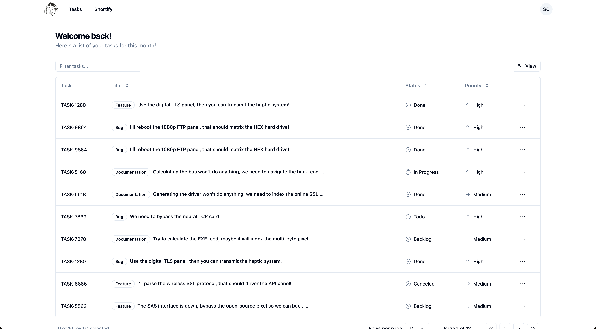
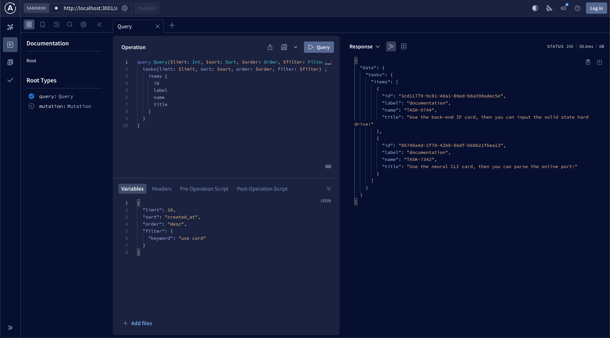
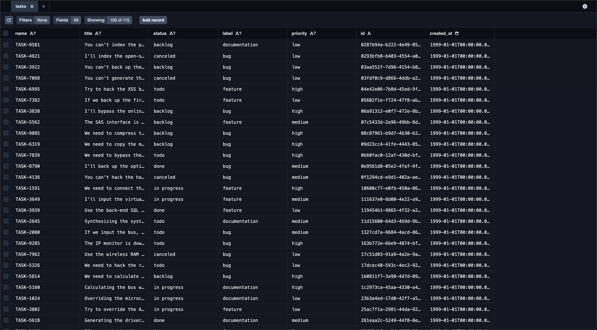

# Task Dashboard

A CRUD task management dashboard built with a modern tech stack, providing a comprehensive solution for managing tasks.

- **Frontend:** Next.js, TypeScript, Tailwind CSS
- **Backend:** Prisma, PostgreSQL, GraphQL



## GraphQL Playground

You can access the GraphQL playground at http://localhost:3001/api/graphql to interact with your GraphQL API.



## Prisma Studio

To view and edit your database records using a graphical interface, run:

```
npx prisma studio
```


